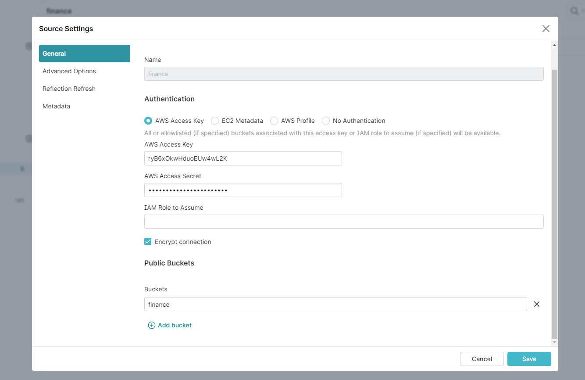
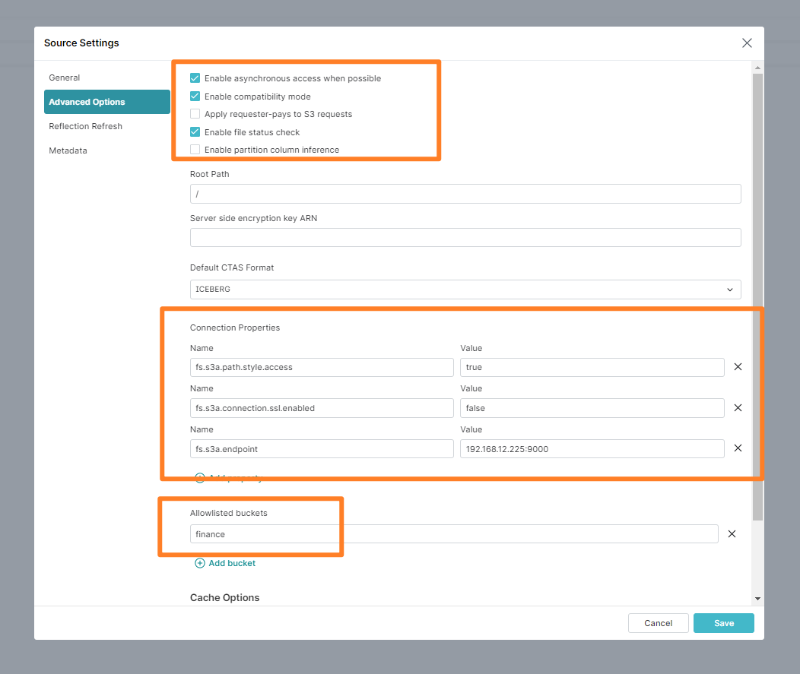

# Dremio

---

### 连接 Minio

1. 新建 `S3` 连接
2. 依次填入 `AccessKey`  `AccessSecret` `bucket`

       PS: 非 HTTPS 情况下不要勾选 Encrypt connect (1个小时文档搜索,血的教训)

3. 打开高级选项,如图填写并保存

        fs.s3a.path.style.access : true
        fs.s3a.connection.ssl.enabled : false
        fs.s3a.endpoint : 192.168.12.225:9000
        fs.s3a.access.key : 
        fs.s3a.secret.key :

