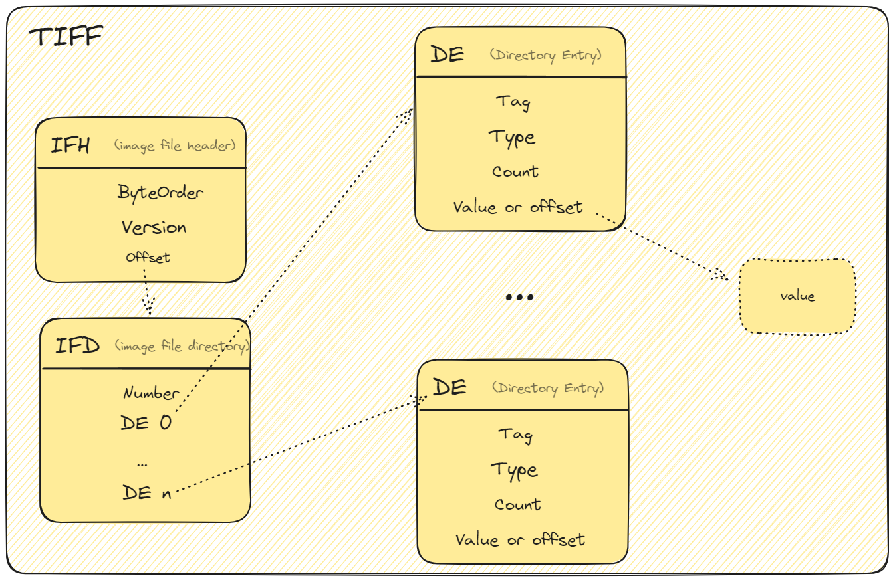

# TIFF

## TIFF Data Structure

-----




#### Original file is [TIFF](tiff.excalidraw) (Please open in excalidraw.com or other excalidraw plugin of IDE)


PS: In windows os , you can use powershell
```Format-Hex .\example.tiff > example.hex```